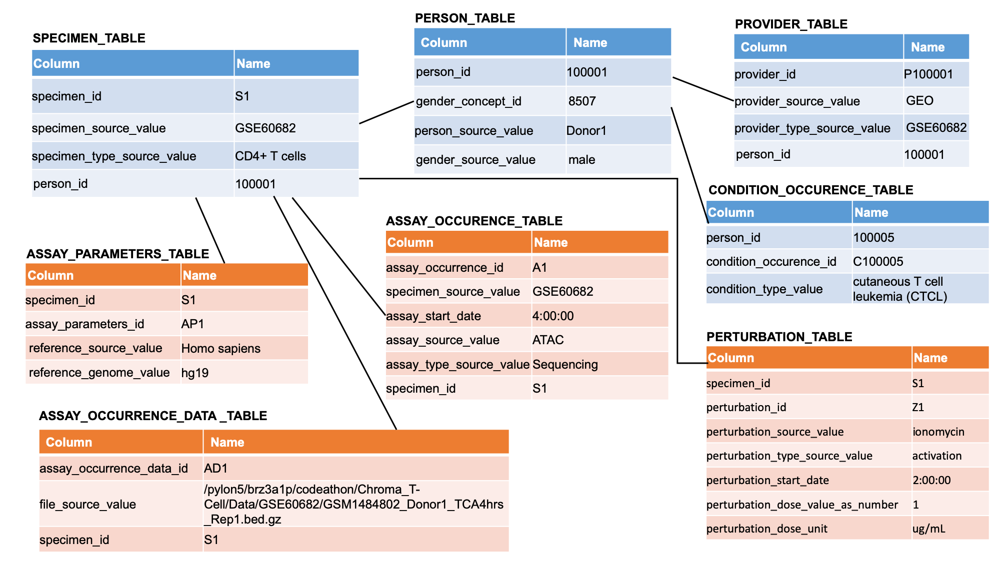
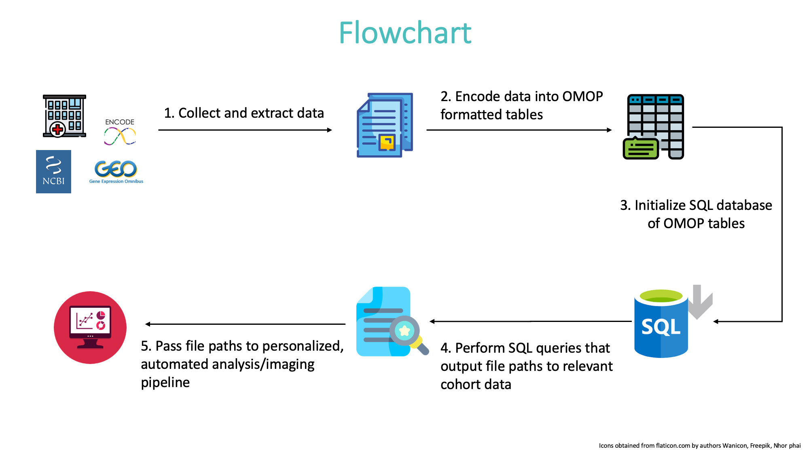

# OMOPOmics

## TLDR

OMOPOmics facilitates standardizing experimental datasets for reproducible research.

## Motivation 

Clinical and claims databases are adopting a common data model data format promoted by Observational Health Data Science and Informatics (OHDSI). Patient data, agnostic of site, can be reproducibly extracted and analysed for generating population and patient-level evidence to improve medical practice. 

This framework can be extended to include patient diagnostic and biological data enabling precision medicine. 


However, experimental data has traditionally not been integrated under this infrastructure. But recently these approaches are more accessible, efficient, and feasible, creating an opportunity to integrate this information. Under the OMOP framework, data from biological experiments with different attributes such as disease states, time points, and perturbations can become more accessible and understood, as well as enable reproducibe analyses. 

OMOPOmics was created in January 2020 to show proof of concept and the importance for putting experimental data into the OMOP common data model. While this model has been primarily used for patient clinical data for insurance and claims purposes, this data infrastructure should be applied to biological experiments. 

We show from public datasets how we can store patient and sample data. Under the OMOP infrastructure, we produce reproducible queries of patient data for downstream use by custom bioinformatic analyses. The question and/or hypothesis should drive the analysis of patient derived experimental data, whether high throughput assays or clinical diagnostic tests. With standardized infrastructure, this data can be reproducibly extracted for performing analyses. While other common data models like the G-CDM stadardize genomic information for use and interpretation by clinicians directly, this framework allows for teams of bioinformaticians and data scientists to support clinicians and researchers by performing analyses over this infrastructure for a wide range of applications and decision support. 

## Application of OMOPOmics

We extended the [OMOP common data model](https://ohdsi.github.io/TheBookOfOhdsi/) for characterizing experimentally-derived patient data, with a specific application towards T-cell data to better treat auto-inflammatory diseases.



We evaluated our infrastructure using example queries and analyses of patient ATAC-seq data sets from individuals with cutaneous T-cell lymphoma, healthy individuals with T-cell activation, or control patients (Qu et.al., 2015 [DOI](https://doi.org/10.1016/j.cels.2015.06.003.)). We manually downloaded and extracted data from GSE60682 in the GEO database. 

We show how to implement standardization of experimental data, to form a database, and to reproducibly query the data and run downstream analysis:



We give an example below. 

### Implementation

1. Download and install requirements

```
git clone https://github.com/NCBI-Codeathons/OMOPOmics.git
cd OMOPOmics/
pip install -r requirements.txt
```

2. Create OMOP formatted tables from standardized experimental data format.

```
$ perl src/perl/output_tables.pl data/GSE60682_standard.tsv data/OMOP_tables
```

3. Create SQL database from OMOP formatted tables: 

`ls data/OMOP_tables/*.csv | csv-to-sqlite -o data/OMOP_tables.sqlite -D`

4. Query database  and output cohort files into data/cohort

```
cd src/R/atac_example/
Rscript ./atac_example_query.R > ./tcell_activation_timecourse.csv
```        
5. Execute downstream analysis 

```
R -e "rmarkdown::render('./20JAN20-atacseq_analysis_parameters.Rmd',params=list(input_file='./tcell_timecourse.csv'),output_format='html_document')"
```

**Result webpage at src/R/atac_example/20JAN09-Example_analysis.html**

## FAQ

**Who would use this?**

- Clinicians, researchers looking to supplement their own data or make their data available to others.

**Why would they use it?**

- Ease of use; SQL database queries are standard format, easily incorporated into a user interface. Given the expandable nature of the platform, changes and updates to the technologies should be easily supported.

**What can OMOPOmics grow into?**

- A standard framework for sequencing data sets at organizations.

**What is the ultimate goal of OMOPomics?**

- OMOPOmics has the potential to nucleate a standardized 'Omics format, one which could pave the way for any number of analyses to come in the future. These include not only upcoming research and new sequencing technologies, but also clinicians looking to incorporate these data from across research and healthcare networks as they apply these technologies to patient care.
