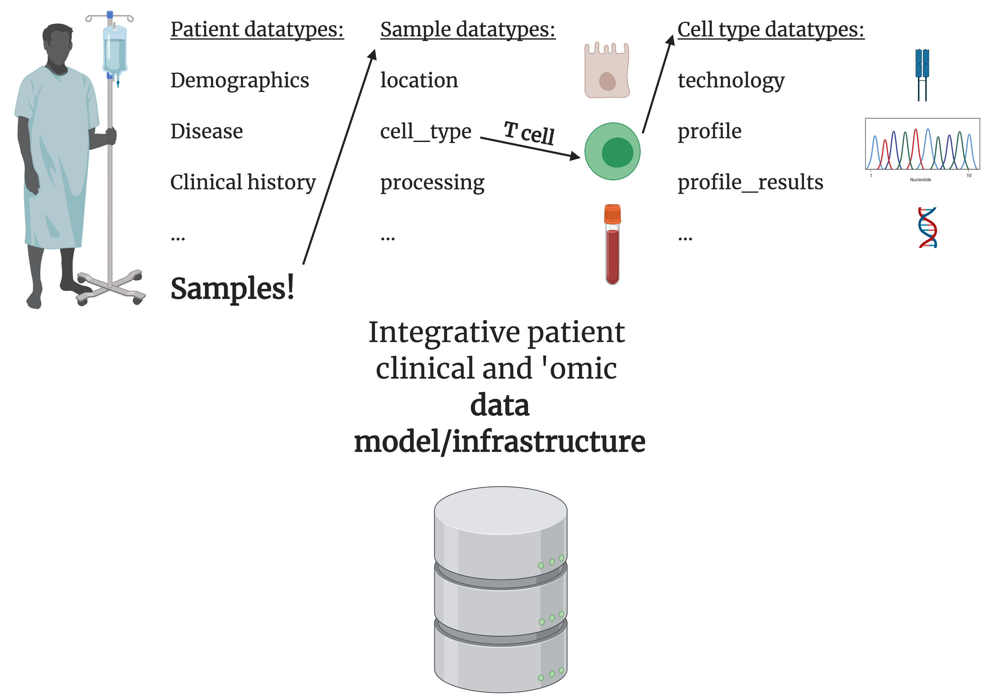

# Chroma-T-cell

There exists limited infrastructure for matching patient electronic health records (EHR) to patient molecular samples. A standardized infrastructure, i.e. following the [OHDSI common data model](https://ohdsi.github.io/TheBookOfOhdsi/), allows for population and patient-level analyses to improve medical practice and understand disease. 

We propose extending an EHR common data model for characterizing associated patient data, with a specific application towards T-cell data to better treat auto-inflammatory diseases.

We will create an extension to the [OHDSI common data model](https://ohdsi.github.io/TheBookOfOhdsi/) towards patient T-cell 'omics profiling. We will evaluate our infrastructure with example queries and analyses. 